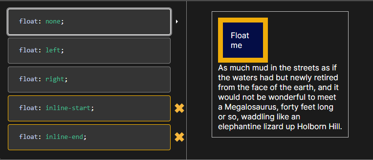

# HTML & CSS Basics

# TABLE OF CONTENT

## I. Introduction

Front-end uses 3 languages HTML, CSS, and JS browser understands and process of writing. Users use a browser to send requests through the domain to a web server the web server responds to browsers. 

HTML is responsible for the content of the page so that the text, video, images, …

CSS is responsible for the presentation of that content so basically for styling and for laying out the element on the page.

JS is the programming language of the front end. It allows us to add dynamic and interactive effects to the webpage. And use it to manipulate the content of the CSS to load data from a web server and even to build entire front-end applications, which we call web applications.

**HTML is not a programming language**

## II. HTML

HTML is a markup language that web developers use to structure and describe the content of the webpage.

### 1. Anatomy of an HTML Element

*In HTML Element have 3 parts opening tag, content, and closing tag.*

`
 Hello World 
` | **This is a Element**

`
` | **This is Opening Tag**

`Hello World` | **This is Content**

`
` | **This is Closing Tag**

### 2. Semantic

*Semantic is a defined element that has meaning.*

### 3. Box-Model

| Inline | Block | Inline-block |
| --- | --- | --- |
| Not change size (width and height) but can change padding-left and padding-right. | Can change size (width, height, padding, margin) if the element is set. | Can change size with properties of inline but can change size as a block. |
| Width: Fit-content | Width: 100% | Width: fit-content |
| When initialized, inline will change the width fit content. | When initialized, the block will change the width by 100%. |  |

**Box-Sizing:** Content-Box; (This is the default, not initialize)

**Box-Sizing:** Border-Box (Use when used inline-block)

## III. CSS

**Cascading Style Sheets**

CSS describes the visual style and presentation of the content written in HTML

CSS consists of countless **properties** that developers use to format the content: properties about font, text, spacing, layout, etc.

### 1. Cascading

Cascading is the process of algorithms resolving conflict CSS from other sources. When CSS pointer to an element, the browser decides on a solution.

Rules to use: 3 Rules

- **Importance**: Author Style
- **Specificity**: Clearly, inline styles, ids, classes, …
- **Source Order:** Last In First Priority

### 2. Three ways to use CSS in HTML

- Internal
- External
- Inline (*Highest Priority*)

### 3. CSS Rule

CSS property declaration use { } as a block

**Example**: 

`h1 { 
color: blue;
}`

**In this block,**

`h1    :`**Selector**

`color :` **Property**

`blue  :` **Value**

### 4. Pseudo Classes

Use ***first-child*** and last-child to set CSS, for example, `li:first-child` and `li:last-child`

Use ***:nth-child(location)*** to set, example `li:nth-child(2)`

Use ***:nth-child(odd)*** to set line odd (Số lẻ), for example `li:nth-child(odd)`

Use ***:nth-child(even)*** to set line even (Số chẵn), for example `li:nth-child(even)`

### 5. Pseudo Element

A CSS pseudo-element is used to style specified parts of an element.

Example: `h1::first-letter`

- ::before
- ::after
- ::first-letter
- ::selection

### 6. Layout: Floats, Flexbox, Grid

The layout is the way text, images, and other content are placed and arranged on a webpage.

The Layout gives the page a visual structure, into which we place our content.

Building a layout: arranging page elements into a visual structure, instead of simply having them placed one after another

**Floats**: **Right or Left**

**Flexbox: Can layout arranging with one direction column or row with structure is main and cross** 

**Grid**: **Can layout arranging with two-direction columns and rows.**

### 7. Box-Sizing

The box model with **box-sizing**: *border-box,* 

**Final element width** = right border + right padding + width + left padding + left border

**Final element height** = top border + top padding + width + bottom padding + bottom border

The box model with box **box-sizing**: *content-box,*

**Final element** = width + height

### 8. Float and How to Float Work?

The **`float`**CSS property places an element on the left or right side of its container, allowing text and inline elements to wrap around it.

And when using float: left/right the layout will be changed

**Attention**: When using a float, an element will have floats to the side of its container. So you need to clear property specifies what elements can float beside the cleared element and on which side. The keyword to research is “Clearfix”.

**Demo Code:** *Here is the code when initializing.*

**Flex Right and Left**

After floating both child elements in the container, we can see that the height of the container is independent of the height of the right div and left div and that the current height of the container div is 0.

But when floating the right div and not the left div floating the height of the container will depend on the left div. (*Image Below*)

### 9. Flexbox

**Flex-direction**: To direct element layout by arranging columns or rows.

- `Justify-content:` space-between/space-around/space-evenly/center/start/end.  (Ox - Horizontally)
- `Align-content`: space-between/space-around/space-evenly/center/start/end. (Oy - vertically)

And flex has 2 shafts used this is the main and the cross.

As I said above, the axes used depend on the main and diagonal axes. The axes will be defined using justify-content and align-content depending on the flex direction.

### 10. Grid

*The CSS Grid Layout Module offers a grid-based layout system, with rows and columns, making it easier to design web pages without having to use floats and positioning.*

**Grid Property**

`Display: grid;` or `inline-grid`

So, with an inline grid, the width of the element will fit the content and change when the content change.

Besides that, the grid can divide columns and rows:

`grid-template-rows: auto auto auto;`

`grid-template-columns: 30px 30px 30px;`

In code, each row and column have 3 columns and 3 rows

**Auto**: width of the grid has been initialized. *(for column)*

**30px**: height of the grid has been initialized. *(for row)*

`gap: 50px` is space between rows with rows and columns with columns.

`column-gap: 50px` is space between columns with columns.

`row-gap: 50px` is space between rows with rows.

**Some property same as flex:**

- `Justify-content:` space-between/space-around/space-evenly/center/start/end.  (Ox - Horizontally)
- `Align-content`: space-between/space-around/space-evenly/center/start/end. (Oy - vertically)

**Some shorthand of grid:**

`grid-column: 1 / 5;` 1 is the border of the grid start and 5 is the border of the grid end.

`grid-column: 1 / span 4` 1 is the columns start and span 4 occupies a total of 4 columns of a row.

`grid-area: grid-row-start / grid-column-start / grid-row-end / grid-column-end.`

